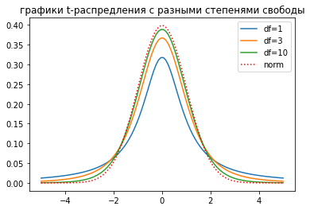

# Введение
## Меры центральной тенденции
**Мода** (mode) – значение признака, котороые встречается максимально часто.

**Медиана** (median) – значение признака, которое делит упорядоченное множество данных пополам.

**Среднее значение** (mean) – сумма всех значений признака, деленная на количество измеренных значений.
$$M_x = \frac{\sum{x_i}}{n}$$
### Обозначения
$M_x$ - среднее значение **генеральной совокупности**
$\bar{x}$ - среднее значение **выборки**
### Свойства среднего
$M_{x+c} = M_x + C$

$M_{x \times c} = M_x \times C$

$\sum{(x_i - M_x)} = 0$
## Меры изменчивости
**Размах** (range) – разность максимального и минимального значения.
**Дисперсия** (variance) – средний квадрат отклонений индивидуальных значений признака от их средней величины.
Для **генеральной совокупности**  $$D_x = \frac{\sum(x_i - \bar{x})^2} {n}$$
Для **выборки** $$D_x = \frac{\sum(x_i - \bar{x})^2} {n-1}$$
**Среднеквадратическое отклонение** (standard deviation, стандартное отклонение) – среднее отклонение индивидуальных значений признака от их средней величины.
$$\sigma = \sqrt{D_x}$$
### Обозначения
$D_x$ - дисперсия **генеральной совокупности**
$\sigma$ - стандартное отклонение **генеральной совокупности**
$sd_x$ - стандартное отклонение **выборки**
### Свойства дисперсии
$$D_{x+c} = D_x
\ ; \quad
sd_{x+c} = sd_x$$
$$D_{x \times c} = D_x \times c^2
\ ; \quad
sd_{x+c} = sd_x \times c$$
## Квантили распределения
**Квантиль** – значение, которое заданная случайная величина не превышает с фиксированной вероятностью:  $P(X\le x_\alpha) \ge \alpha$

**Квартили** – три значения признака, которые делят упорядоченное множество данных на четыре равные части.
## Нормальное распределение
Нормальное распределение унимодально, симметрично, отклонения наблюдений от среднего подчиняются определенному вероятностному закону **(правило 3$\sigma$):**
**Стандартизация (Z-преобразование)** – преобразование полученных данных в стандартную Z-шкалу (Z-scores) со средним $M_z$ = 0 и дисперсией $D_z$ = 1.
$$z_i = \frac{x_i - \bar{x}}{{sd}_x}$$
## Центральная предельная теорема. 
При многократном повторении эксперимента выборочные средние симметричным образов распределяться вокруг среднего значения генеральной совокупности, а стандартное отклонение такого распределения выборочных средних – стандартная ошибка среднего.
$${se}_x = \frac{\sigma}{\sqrt{n}}$$
## Доверительный интервал для  среднего
$\left[ \mu - 1.96 \sigma; \mu + 1.96 \sigma \right]$ – **95%** всех выборочных средних включили бы в данный интервал среднее генеральной совокупности μ

$\left[ \mu - 2.58\sigma; \mu + 2.58\sigma \right]$ – **99%** доверительный интервал

В центре находится выборочное значение выборки.

## Идея статистического вывода
**Нулевая гипотеза** (*H0*) – отсутствие значимых различий между средним значением выборки и средним значением генеральной совокупности.
**Альтернативная гипотеза** (*H1*) – значимое отклонение между средним значением выборки и средним значением генеральной совокупности.

**Ошибка 1 рода** – приняли альтернативную гипотезу, хотя верна нулевая.
(ошибка, состоящая в опровержении верной гипотезы; false positive)

**Ошибка 2 рода** – приняли нулевую гипотезу, хотя верна альтернативная.
(ошибка, состоящая в принятии ложной гипотезы; false negative)

$p$-уровень значимости – вероятность получения такого или еще более сильного отклонения от среднего значения, если верна $H_0$. Чем меньше $p$, тем больше оснований отклонить нулевую гипотезу.

### Вычисление $p$-уровня значимости для нормального распределения
**1.** Найти на сколько стандартных отклонений (величину $z$) среднее из новой экспериментальной выборки отличается от предполагаемого среднего значения в генеральной совокупности: 
$$z = \frac{x - \mu}{se}$$
**2.** Определить, какой процент значений находится на промежутке $\left[-\infty ; -z\right]\cup \left[z ; +\infty \right]$
**3.** Если полученное значение $p < 0.05$, принимаем *H1*, т.е. мы получили статистически значимое отклонение.

# Сравнение средних
## Распределение Стьюдента (t-распределение)

Если число наблюдений невелико и стандартное отклонение генеральной совокупности σ неизвестно, то используется распределение Стьюдента (t-distribution): 
* унимодально
* симметрично
* наблюдения с большей вероятностью попадают за пределы $\pm 2 \sigma$ от $\mu$, чем при нормальном распределении.

Форма распределения определяется числом степеней свободы ($df = n-1$, degrees of freedom).
С увеличением $df$ распределение стремится к нормальному.

Подробно про нормальное и t-распределение [туть](normalAndT.md).

## Сравнение двух средних; t-критерий Стьюдента
t-критерий Стьюдента — общее название для статистических тестов, в которых статистика критерия имеет распределение Стьюдента. Наиболее часто t-критерии применяются для проверки равенства средних значений в двух выборках. Нулевая гипотеза предполагает, что средние равны (отрицание этого предположения называют гипотезой сдвига). Для применения данного критерия необходимо, чтобы исходные данные имели нормальное распределение.
$$t = \frac{\bar{X_1} - \bar{X_2}}{se}$$
$$se = \sqrt{ \frac{{sd}^2_1}{n_1} + \frac{{sd}^2_2}{n_2} }$$

### Доказательство
$$( se_1 )^2 = \Big(\frac{sd_1}{\sqrt{n_1}}\Big)^2 = 
	\frac{sd^2_1}{n_1}$$
	
$$se 
= \sqrt{ \frac{{sd}^2_1}{n_1} + \frac{{sd}^2_2}{n_2} }
= \sqrt{ {se}^2_1 + {se}^2_2 }$$

Дисперсия суммы независимых случайных величин равна сумме их дисперсий, а отклонение - это корень из дисперсии. $\blacksquare$
### Некоторые зависимости
-   $(x_1-x_2)$↑ → $t$↑ (чем больше разница между средними в выборках, тем больше t-критерий)
-   $sd$↓ → $t$↑
-   $n$↑ → $t$↑
-   $t$↑ → $p$↓

### Применимость критерия Стьюдента
- Независимость каждого из наблюдений
- Гомогенность дисперсий, т.е. дисперсии в двух выборках приблизительно одинаковы. (проверяется критерием Левана или критерием Фишера)
- Нормальность распределения (про это лучше прочитать статью снизу)

[Статья](https://koch-kir.medium.com/%D0%B8%D1%81%D1%82%D0%BE%D1%80%D0%B8%D1%8F-%D0%BE%D0%B4%D0%BD%D0%BE%D0%B3%D0%BE-%D0%BE%D0%B1%D0%BC%D0%B0%D0%BD%D0%B0-%D0%B8%D0%BB%D0%B8-%D1%82%D1%80%D0%B5%D0%B1%D0%BE%D0%B2%D0%B0%D0%BD%D0%B8%D1%8F-%D0%BA-%D1%80%D0%B0%D1%81%D0%BF%D1%80%D0%B5%D0%B4%D0%B5%D0%BB%D0%B5%D0%BD%D0%B8%D1%8E-%D0%B2-%D1%81%D1%82%D0%B0%D1%82%D0%B8%D1%81%D1%82%D0%B8%D1%87%D0%B5%D1%81%D0%BA%D0%B8%D1%85-%D1%82%D0%B5%D1%81%D1%82%D0%B0%D1%85-55139a5558d) про требования к распределению в t-тесте

## Проверка на нормальность
#TODO
###  Тест Шапиро-Уилка
**Если распределение отличается от нормального используется Критерий Манна-Уитни**. Он переводит все данные в ранговую шкалу. Такой критерий гораздо менее чувствителен к отклонениям от нормальности и может быть использован при наличии значительных выбросов в выборке.
![[shapiro-wilk.jpg]]
## Однофакторный дисперсионный анализ
Дисперсионный анализ - **ANOVA** (от англ. **AN**alysis **O**f **VA**riance)

Рассмотренный ранее **t-критерий Стьюдента** (равно как и его непараметрические аналоги) предназначен для сравнения исключительно **двух совокупностей**. В таком случае мы можем применять однофакторный дисперсионный анализ. Та переменная, которая будет разделять наших испытуемых или наблюдения на группы (номинативная переменная с нескольким градациями) называется **независимой переменной**, а та количественная переменная, по степени выраженности которой мы сравниваем группы, называется **зависимая переменная**.

$$ \displaylines{
	H0 : M_1 = M_2 = ... = M_i \ ;
	\\ H1 : \ \neg(M1 = M2 = ... = Mi)
} $$
| Source of variance |                                         Sum of squares                                          | Degrees of freedom |        Mean squares        |            F            |
|:------------------:|:-----------------------------------------------------------------------------------------------:|:------------------:|:--------------------------:|:-----------------------:|
|       Within       |              $SS_{within} = \sum_{j=1}^{p}\sum_{i=1}^{n_j}(x_{ij} - \bar{x_j})^2$               |    $df_w = k-1$    | $MS_w = \frac{SS_w}{df_w}$ | $F = \frac{MS_b}{MS_w}$ |
|      Between       |                   $SS_{between} = \sum_{j=1}^{p} n_j (\bar{x_j} - \bar{x})^2$                   |     $df_b=n-k$     | $MS_b = \frac{SS_b}{df_b}$ |                         |
|       Total        | $SS_{total} = \sum_{j=1}^{p}\sum_{i=1}^{n_j} (x_{ij} - \bar{x})^2 = SS_{between} + SS_{within}$ |     $df_t=n-1$     |                            |                         |
-   Если большая часть общей изменчивости ($SS_{total}$) обеспечивается благодаря изменчивости между группами ($SS_{between}$), это означает, что группы различаются между собой.
-   Если большая часть общей изменчивости ($SS_{total}$) обеспечивается благодаря внутригрупповой изменчивости ($SS_{within}$), то это говорит о том, что группы не различаются.
-   Если межгрупповой показатель изменчивости ($SS_{between}$) значительно превышает внтуригрупповой ($SS_{within}$), то весьма вероятно что как минимум два средних значения отличаются друг от друга.
### F-критерий Фишера
*Критерий Фишера* применяется для проверки равенства дисперсий двух выборок.

$$F = \frac{SS_b / (m - 1)} {SS_w / (N - m)}
= \frac{MS_b}{MS_w}$$
## Множественное попарное сравнение
Применяя однофакторный дисперсионный анализ, мы можем проверить нулевую гипотезу о том, что все сравниваемые группы происходят из одной генеральной совокупности, и следовательно их средние значения не различаются, т.е. $H_0 : M_1 = M_2 = ... = M_i$. Если нулевую гипотезу не удается отвергнуть при заданном уровне значимости (например, $\alpha = 0.05$), в дальнейшем анализе, в принципе, нет необходимости. Но если нулевая гипотеза отвергается, мы делаем заключение о том, что средние значения сравниваемых групп значительно различаются (другими словами, изучаемый фактор оказывает существенное влияние на интересующую нас переменную). Это единственный вывод, который можно сделать при помощи дисперсионного анализа как такового. Однако какие именно группы отличаются друг от друга? Чтобы узнать это, необходимо выполнить попарные сравнения средних значений имеющихся групп. Критерий Стьюдента "в чистом виде" для таких сравнений неприменим в силу возникновения эффекта множественных сравнений. Поэтому при множественном попарном сравнении используются поправки.
### Поправка Бонферрони
Если вероятность ошибки первого рода (получить значимые различия там, где их нет) возрастает пропорционально количеству групп, которые мы сравниваем между собой, то допустимый показатель $p$-уровня значимости (т.е. значение _p_, ниже которого различия считаются достоверными, обычно $\alpha = 0.05$) нужно скорректировать на количество всех возможных комбинаций пар из имеющихся групп $C^2_m = m! / (2! \times (m-2)!) = m \times (m-1) / 2$
  
Т.е. новый допустимый показатель $p$-уровня значимости: $\alpha = \frac{p}{С^2_m}$
### Критерий Тьюки
При наличии большого числа сравниваемых групп метод Бонферрони становится очень консервативным, часто не позволяя отвергнуть даже те гипотезы, которые со всей очевидностью должны быть отвергнуты. Для решения описанной проблемы (т.е. для выполнения большого числа попарных сравнений групповых средних без потери статистической мощности) используется $q$-критерий Тьюки (Tukey HSD), который представляет собой модифицированный критерий Стьюдента: 
$$q = \frac{\bar{X}_A - \bar{X}_B}{SE}$$

Когда все сравниваемые группы содержат одинаковое число наблюдений $m$: $SE = \sqrt{ \frac{MS_w} {m}}$

Когда сравниваемые группы содержат различное число число наблюдений $m$: $SE = \sqrt{\frac{MS_w}{2} \left ( \frac{1}{n_A} + \frac{1}{n_B} \right ) }$

Благодаря тому обстоятельству, что в приведенных выше формулы стандартной ошибки входит внутригрупповая дисперсия $MS_w$, обеспечивается контроль над групповой вероятностью ошибки первого рода. Именно это делает критерий Тьюки подходящим критерием для выполнения большого числа попарных сравнений групповых средних.

Рассчитываются доверительные интервалы разности между средними значениями групп ($\bar{X}_A - \bar{X}_B$). Если такой интервал не включает в себя ноль, то можно отклонить нулевую гипотезу $H_0$ о равенстве двух средних.

Критерий Тьюки имеет те же условия применимости, что и дисперсионный анализ:

1.  **нормальность распределения данных**
2.  (особенно важно!) **однородность групповых дисперсий** (подробнее см. [здесь](https://r-analytics.blogspot.com/2013/05/blog-post.html)). Для проверки используем тест Левина (если $p < 0.05$, то проверка пройдена)

Устойчивость к отклонению от этих условий, равно как и статистическая мощность критерия Тьюки, возрастают при одинаковом числе наблюдений во всех сравниваемых группах.

## Двухфакторный дисперсионный анализ
Формула общей изменчивости:
$$SS_T = SS_W + SSB_A + SSB_B + SSB_A \times SSB_B$$
# Корреляция и регрессия
**Корреляция** – взаимосвязь двух факторов. Может быть положительная/прямая (значение коэффициента корреляции имеет знак '$+$') и отрицательная/обратная (значение коэффициента корреляции имеет знак '$-$'). Если значение коэф-та корреляции близко к нулю, то скорее всего, факторы не имеют взаимосвязи.

**Коэффициент ковариации** – мера линейной зависимости двух переменных:

$$\mathrm{cov}_{XY} =
\frac{ \sum {(x_i - \bar{X}) \times (y_i - \bar{Y})}}
{N - 1}$$

**Коэффициент корреляции (Пирсона)** – показатель силы и направления взаимосвязи двух количественных переменных:
$$\mathrm{r}_{XY} = \frac{\mathrm{cov}} {\sigma_x \times \sigma_y} \in [-1;1]$$

**Коэффициент детерменации** – показывает в какой степени дисперсия одной переменной обусловлена 'влиянием' другой переменной:

$$R^2 = \mathrm{r}_{XY}^2 \in [0;1]$$

**Проверка статистических гипотез:**  

$H_0:\mathrm{r}_{XY}=0; H_1: \mathrm{r}_{XY} \ne 0$

Для это найдём $t$-значение при числе степеней свобод $df = N - 2$ (2 - т.к. мы работаем с двумя переменными $x$ и $y$)

Прежде чем сделать вывод, важно помнить:
-   Положительная или отрицательная корреляция не говорит о причинно-следственной зависимости между переменными.
-   Корреляция между двумя переменными может обуславливаться существованием третьей переменной, влияющей на обе эти переменные.

  
**Условия применимости коэффициента корреляции:**
1.  Коэффициент корреляции применим если **взаимосвязь линейна и монотонна**
2.  **Нормальное распределение переменных** (значительные выбросы могут негативно сказаться на значении коэффициента корреляции)

Если имеются значительные выбросы, можно попробовать использовать непараметрические аналоги коэффициента корреляции, которые переходят от реальных значений переменных к ранжированным значениям.
-   Коффициент корреляции Спирмана
-   Коффициент корреляции Кендалла

## Одномерный регрессионный анализ
Одномерный регрессионный анализ (простая линейная регрессия) применяется для исследования взаимосвязи двух количественных переменных (независимая переменная – предиктор и зависимая переменная – критериальная). Изучает как одна переменная определяет/позволяет предсказать другую переменную.

**Линия регрессии (линия тренда)** задается уравнением:
$$y = b0 + b1 \cdot x$$
где $b_0$ – свободный член (intercept), который отвечает за значение $y$, где линия пересечет ось $OY$;
$b_1$ – угловой коэффицент (slope), задаёт угол наклона между осью $OX$ и графиком.

**Метод наименьших квадратов** – метод нахождения оптимальных параметров линейной регресии, таких, что сумма квадратов ошибок (остатков) была минимальна.
**Остаток** - расстояние от реального значения до предсказаннного значения, лежащего на прямой.

Необходимо подобрать $b_0$ и $b_1$ так, чтобы линия максимально адекватно отображала связь данных переменных.
$$b_1 = \frac{sd_y}{sd_x} r_{xy}$$
$$b_0 = \bar{Y} - b_1 \bar{X}$$
Гипотеза о значимости взаимосвязи:
$H_0 : b_1 = 0$ (т.к. $r_{xy} = 0$) ; $H_1 : b_1 \ne 0$

Для это найдём $t = \frac{b_1}{se}$ при числе степеней свобод $df = N - 2$

**Коэффициент детерминации** – доля дисперсии зависимой переменной $Y$, объясняемая регресионной моделью.
$$R^2 = 1 - \frac{SS_{res}}{SS_{total}}$$
где $SS_{res}$ – (residuals) сумма квадратов остатков (расстояний до регрессионой прямой), а $SS_{total}$ – общая изменчивость (сумма квадратов расстояний до прямой $y = b_0 = Y$). Таким образом, означает, что почти вся изменчивость переменной объясняется нашей регрессионной моделью.
### Условия применения линейной регрессии
1. **Линейная взаимосвязь $X$ и $Y$.** Если зависимость на самом деле нелинейна, то предсказание будет ошибочно.
*Проверка*: Построить Scatter plot (диаграмма рассеяния)
*Пути ликвидации нелинейности*
-   Трансформация Тьюки (Tukey Ladder of Powers) – возведение _X_ в степень, теряется интерпретируемость.
- Логарифмическая трансформация (Log transformation) – взятие логарифма от $X$ и/или $Y$, интерпретируемость коэффициента наклона $b_1$:
    1.  $(log Y = b_0 \ log X)$ – на сколько процентов увеличится значение зависимой переменной при изменении зависимой переменной на 1%.
    2.  $(log Y = b_0 + b_1  X)$ – при единичном изменении переменной _X_, переменная _Y_ в среднем изменяется на $100 \times b_1$ процентов.
    3.  $(Y = b_0 + b_1 X)$ – изменение на $1\%$ по $X$ в среднем приводит к $0.01 b_1$ изменению по переменной $Y$.
-   Трансформация Бокса-Кокса (Box-Cox transformation) – обычно используется для трансформации зависимой переменной в случае, если у нас есть ненормальное распределение ошибок и/или нелинейность взаимосвязи, а также в случае гетероскедастичности.

2. **Независимость наблюдений.**
*Источники:*
-   Повторные измерения (на разных уровнях независимой переменной): снижение чувствительности теста, искуственное увелечение мощности теста (псевдореплекация).
-   Повторные пробы (на одном и том же уровне независимой переменной): искажение результатов.
-   Кластерезация данных (нет повторных измерений, но данные взяты из нескольких гомогенных групп): искажение результатов.

**3. Независимость предикторов.** Отсутствие мультиколлинеарности – линейной зависимости между предикорами.
-   Абсолютная мультиколлинеарность – корреляция между двумя предикторами равна $\pm 1$.
-   Если мы хотим только предсказывать значения, то мультиколлинеарность не проблема.
-   Для выявления можно построить корреляционную матрицу.
-   VIF (Variance Inflation Factor) – показывает, насколько хорошо предиктор объясняется другими предикторами. Если VIF > 10, то предиктор лучше исключить из модели. Квадратный корень из VIF показывает, во сколько раз стала больше стандартная ошибка данного коэффициента, по сравнению с ситуацией, если он был независим от других предикторов.
**4. Нормальное распределение остатков**.
*Проверка:* Построить график распределения остатков: Q-Q plot (график квантиль-квантиль) или Histogramm (гистограмма)
**5. Гомоскедастичность** – одинаковая изменчивость зависимой переменной на всех уровнях независимой переменной (постоянная изменчивость остатков). Т.е. ведут ли себя остатки одинаково относительно прямой $y = b_0 + b_1 \ x$ на протяжении всего регресиионого анализа.

*Проверка:* Построить график распределения остатков Scatter plot (диаграмма рассеяния)
Если мы построим регрессию, где зависимой переменной будет квадрат остатков модели $Y \sim X$, а независимой переменной будет предиктор $X$, и в этой модели окажется высокий и значимый $R^2$, это означает, что в данных есть гетероскедастичность.  
  
*Проверка:* Тест Бройша — Пагана (Breusch-Pagan test), тест Уайта (White test).

6. **Отсутствие автокорреляции остатков.**

## Многофакторный регрессионный анализ
Множественная линейная регрессия позволяет исследовать влияние сразу нескольких независимых переменных на одну зависимую переменную:
$$y = b_0 + b_1 \ x_1 + ... + b_n \ x_n$$При двухфакторной линейной регресии в качестве остатков выступает не расстояние до прямой линии $y = b_0 + b_1 \ x$, а расстояние до плоскости (проекции на плоскость) $y = b_0 + b_1 \ x_1 + b_2 \ x_2$

**Исправленный $R^2$** (adjusted R-squared) – скорректированный коэффициент детерменации. Рассчитывается при включении в модель дополнительных независимых переменных.

### Требования к данным при многофакторной регресии:
1. **Линейная зависимость переменных**
2. **Нормальное распределение остатков**
3. **Гомоскедаcтичность**
4. **Нормальное распределение переменных** (желательно)
5. **Проверка на мультиколлинеарность**.
**Мультиколлинеарность** - очень сильная взаимосвязь между какими-то из предикторов (независимых переменных). Если две переменные очень сильно взаимосвязаны, то достаточно только одной из них, чтобы хорошо объяснить зависимую переменную.